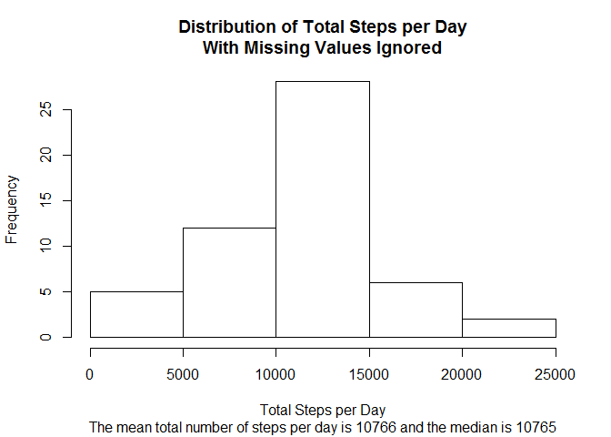
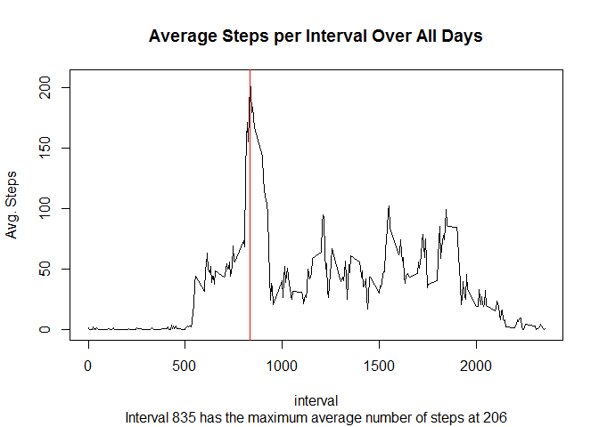
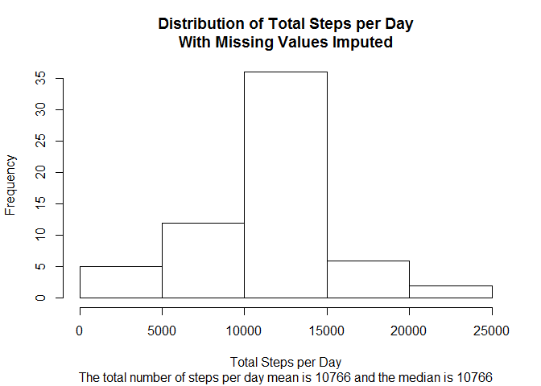
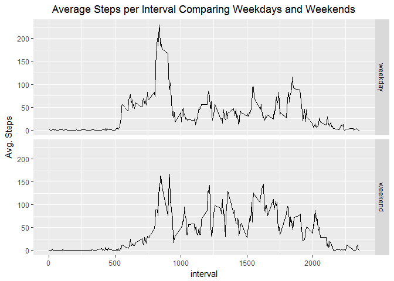

# Reproducible Research: Peer Assessment 1


## Loading and preprocessing the data


```r
unzip("activity.zip")
activity.df <- read.csv("activity.csv")
activity.df$date <- as.Date(activity.df$date)
```

## What is mean total number of steps taken per day?


```r
library(dplyr, warn.conflicts=FALSE)
activity.df <- group_by(activity.df, date)
daysteps.df <- summarize(activity.df, dsteps = sum(steps))

hist(daysteps.df$dsteps, xlab="Total Steps per Day",
     main="Distribution of Total Steps per Day\nWith Missing Values Ignored")
title(sub=paste( "The mean total number of steps per day is", round(mean(daysteps.df$dsteps,na.rm=TRUE)), 
       "and the median is", median(daysteps.df$dsteps, na.rm=TRUE)))
```

<!-- -->


## What is the average daily activity pattern?

```r
activity.df <- group_by(ungroup(activity.df), interval )
intervalsteps.df <- summarize(activity.df, avgsteps = mean(steps,na.rm=TRUE))

with(intervalsteps.df, plot(interval,avgsteps,type="l",ylab="Avg. Steps",
                            main="Average Steps per Interval Over All Days"))
maxavgsteps <- max(intervalsteps.df$avgsteps)
maxint <- intervalsteps.df[which.max(intervalsteps.df$avgsteps),"interval"]
title(sub=paste("Interval",maxint,"has the maximum average number of steps at", round(maxavgsteps)))
abline(v=maxint,col="red")
```

<!-- -->


## Imputing missing values
### Total number of missing values
  
There are 2304 missing values.
  
### Strategy for filling in all of the missing values  
  
A missing value for the number of steps taken in a given interval on a given day 
will be imputed with the average number of steps taken 
in that interval over all non-missing days.  

```r
# Separate the complete cases from the incomplete cases

activity.df <- ungroup(activity.df)
origcomplete.df <- activity.df[complete.cases(activity.df),]
missingdata.df <- activity.df[complete.cases(activity.df)==FALSE,]

# Using the average number of steps for each interval that was 
# calculated in the last section, assign the interval average
# to the corresponding interval for all days in the incomplete cases subset

imputeddata.df <- missingdata.df
for (i in intervalsteps.df$interval) {
        imputeddata.df[imputeddata.df$interval==i, "steps"] <- 
                intervalsteps.df[intervalsteps.df$interval==i, "avgsteps"]
}

# Recombine the complete cases with the imputed values filled
# missing cases and put the recombined dataset in the original 
# sort order for good measure

fulldata.df <- rbind(origcomplete.df,imputeddata.df)
fulldata.df <- arrange(fulldata.df,date,interval)
```
### Histogram and totals

```r
fulldata.df <- ungroup(fulldata.df)
fulldata.df <- group_by(fulldata.df, date)
fulldata.daysteps.df <- summarize(fulldata.df, dsteps = sum(steps))

hist(fulldata.daysteps.df$dsteps, xlab="Total Steps per Day",
     main="Distribution of Total Steps per Day\nWith Missing Values Imputed")
title(sub=paste( "The total number of steps per day mean is", round(mean(fulldata.daysteps.df$dsteps)), 
  "and the median is", round(median(fulldata.daysteps.df$dsteps))))
```

<!-- -->
  
### Impact of imputing missing data

As is desirable, there is no significant change in the overall distribution of the
data when mean interval values are used to impute the missing daily interval values.
  
## Are there differences in activity patterns between weekdays and weekends?
  

```r
fulldata.df <- ungroup(fulldata.df)
fulldataw.df <- mutate( fulldata.df, daytype = 
                                ifelse(weekdays(as.Date(date, origin="1899-12-31")) %in% c("Saturday","Sunday"),"weekend","weekday"))

fulldataw.df$daytype <- as.factor(fulldataw.df$daytype)

fulldataw.df <- group_by( fulldataw.df, daytype, interval)
fulldataw.avgintsteps.df <- summarize(fulldataw.df, avgsteps = mean(steps))

library(ggplot2)
theme_update(plot.title = element_text(hjust = 0.5))
qplot(interval, avgsteps, data=fulldataw.avgintsteps.df,facets=daytype~.,geom="line",
      main="Average Steps per Interval Comparing Weekdays and Weekends", ylab="Avg. Steps")
```

<!-- -->
  
The pattern of steps on weekends is more evenly distributed than on weekdays, where
there is a dominant peak around interval 835.
